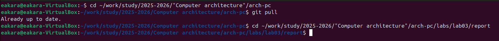
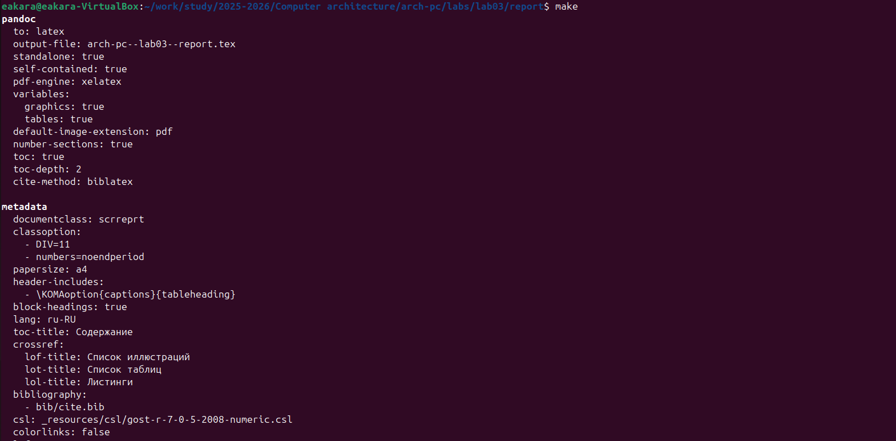
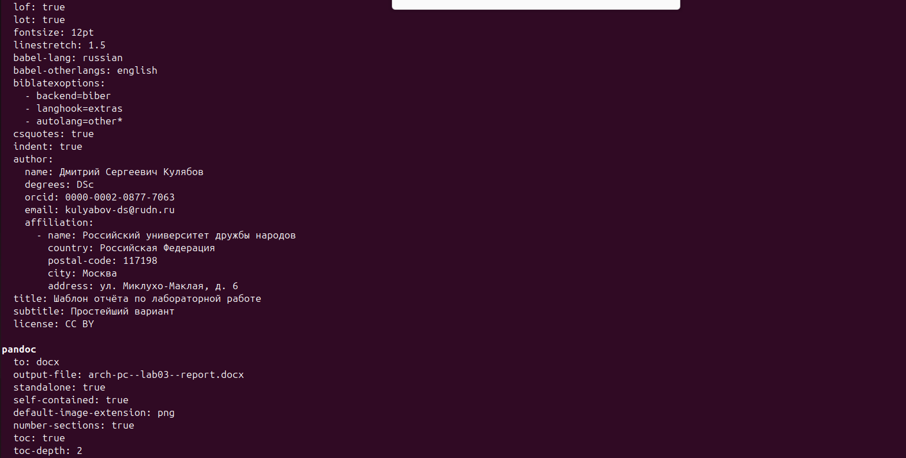
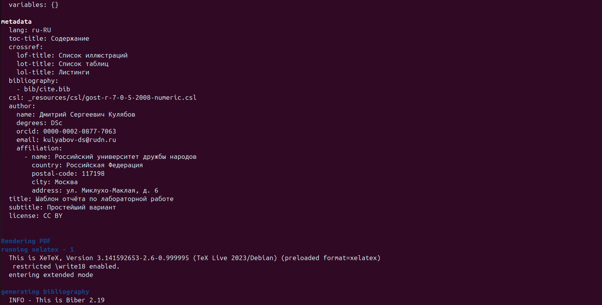
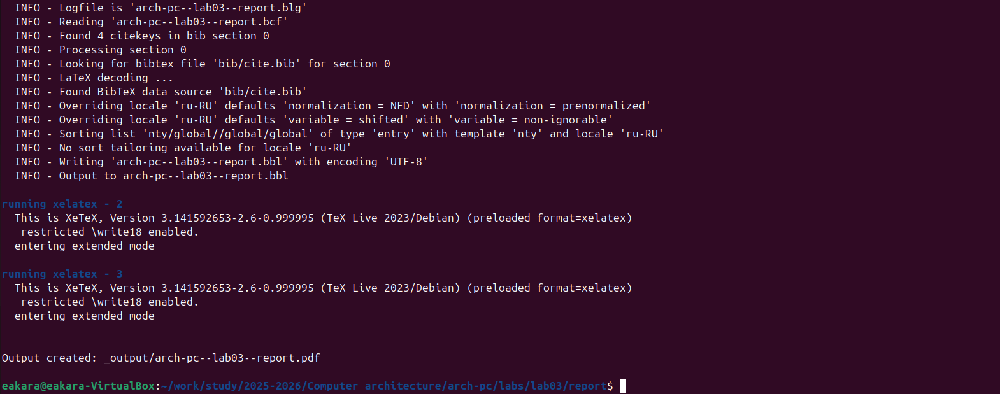
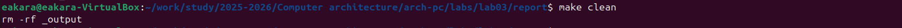
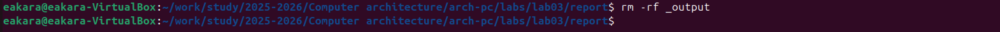
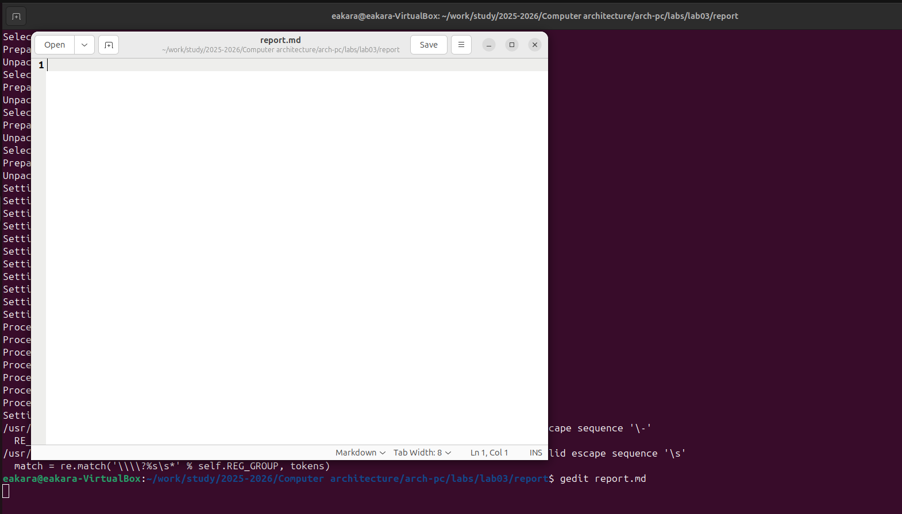
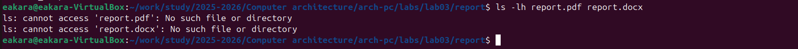

# Лабораторная работа №3

## Ход работы
Первый скриншот:

Второй:

Третий: 

Четвертый:

Пятый:

Шестой:

Седьмой:

Восьмой:

Девятый:

## Вывод
В ходе лабораторной работы мы освоили процедуры оформления отчетов с помощью легковесного языка разметки Markdown: оформление изображений, генерирование файлов и компелирование отчёта.
